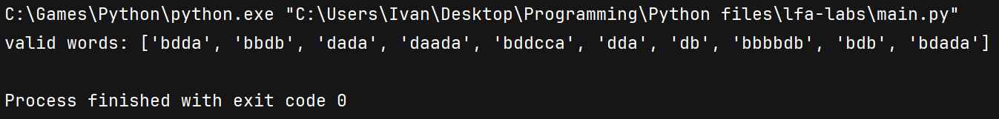
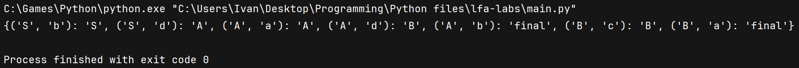
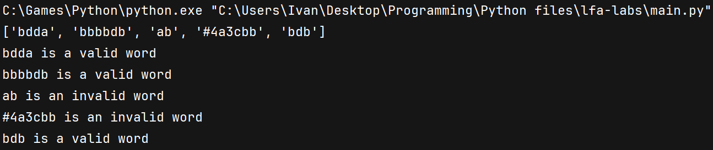

# Lab 1 Report: Intro to formal languages. Regular grammars. Finite Automata.

### Course: Formal Languages & Finite Automata
### Author: Ivan Rudenco

----

## Theory:
Regular grammars are formal systems used to describe regular languages, which can be recognized by finite automata.
They consist of production rules that generate strings following a specific pattern, typically defined by regular expressions.
They are like step-by-step instructions for building words that follow specific patterns. These patterns can be checked using finite automata, which are like tiny decision-making machines with a limited number of states.
Finite automata are abstract machines with a finite number of states used to process strings and determine whether they belong to a given regular language.
There are two types of finite automata: deterministic, where each input leads to a unique state, and nondeterministic, where multiple transitions can exist for the same input.
Regular grammars and finite automata are equivalent in expressive power, meaning any language described by a regular grammar can be accepted by a finite automaton and vice versa.

## Objectives:

- According to variant, implement a type/class for your grammar;

- Add one function that would generate 5 valid strings from the language expressed by your given grammar;

- Implement some functionality that would convert and object of type Grammar to one of type Finite Automaton;

- For the Finite Automaton, please add a method that checks if an input string can be obtained via the state transition from it;

## Implementation description

To store the grammar rules of my variant, I added two lists to store terminal and non-terminal symbols.
Derivation rules are stored as a dict with non-terminal symbols as keys and lists of products as values.

```py
vn = ['S', 'A', 'B']
vt = ['a', 'b', 'c', 'd']

p = {
    'S': ['bS', 'dA'],
    'A': ['aA', 'dB', 'b'],
    'B': ['cB', 'a']
}
```

In order to implement grammar, I've made a Grammar class. To instantiate it we need the set of terminal symbols, non-terminal symbols, and derivation rules.

```py
class Grammar:
    def __init__(self, vn, vt, p):
        self.vn = vn
        self.vt = vt
        self.p = p
```

The method below generates and returns a string according to derivation rules.
We start with string `'S'` and begin a loop replacing last character according to derivation rules.
The loop goes as long as there are non-terminal symbols present in the string.
Replacement occurs by selecting a random rule for the current character from the derivation dictionary.

```py
for letter in string:
    initial_step = f"{''.join(string)}"
    if letter in self.vn:
        # select any appropriate rule
        replacement = list(random.choice(self.p[letter]))
        letter_index = string.index(letter)
        string.pop(letter_index)

        # derive replacement
        for item in replacement:
            string.insert(letter_index, item)
            letter_index += 1
```

The method below is a helper that returns `n` unique words from our language.
It calls the `generate_string` method until `n` unique strings are obtained.

```py
def get_n_strings(self, n):
    words = []
    while len(words) < n:
        word = self.generate_string()
        if word not in words: words.append(word)

    return words
```

In order to implement finite automaton, I've added a new class.
To instantiate it we need to pass the set of terminal symbols and the derivation rules.

```py
class FiniteAutomaton:
    def __init__(self, vt, p):
        self.vt = vt
        self.p = p
        self.trans = self.map_transitions()
```

The `trans` parameter is a mapping of current state and input symbol to the next state.
It is stored as a dict of the following structure `{ (current_state, input_symbol) : next_state }`
This dict is generated from the derivation rules through `map_transitions` method shown below:

```py
def map_transitions(self):
    vt = self.vt
    p = self.p
    trans = {}

    for vn, rules in p.items():
        for rule in rules:
            if len(rule) == 1 and rule in vt:  # terminal char -> final state
                trans[(vn, rule)] = 'final'
            elif len(rule) >= 2:
                symbol = rule[0]
                next = rule[1]
                trans[(vn, symbol)] = next

    return trans
```

This method goes through each rule in the derivation rules dict.
Each non-terminal char is treated like a state.
Each `(Vn, rule)` pair expands into tuples of `(current_state, input_symbol)` and is mapped to the corresponding next state.
With this mapping, it's very easy to verify if an input string belongs to our language:

```py
def str_belongs_to_lang(self, str):
    q = 'S'
    for s in str:
        if (q, s) not in self.trans:
            return False
        q = self.trans[(q, s)]
    return q == 'final'
```

We set the initial state as `'S'`, and for each char check if `(current_state, char)` tuple is present in the transition dict.
If it is, we take the corresponding state from our dict and update current state.
After going through all chars, we check current state, and if it's `'final'` the word is validated. Otherwise, reject the word.
To test how all this works, I wrote this snippet:

```py
from grammar import Grammar
from finite_automaton import FiniteAutomaton

vn = ['S', 'A', 'B']
vt = ['a', 'b', 'c', 'd']

p = {
    'S': ['bS', 'dA'],
    'A': ['aA', 'dB', 'b'],
    'B': ['cB', 'a']
}

g1 = Grammar(vn, vt, p)
a1 = FiniteAutomaton(g1.vt, g1.p)

for str in g1.get_n_strings(100):
    if not a1.str_belongs_to_lang(str): print(str)
```

It generates 100 valid words, and then verifies if they belong to our language.
If an invalid word is encountered, it will be printed out.

## Conclusions / Screenshots / Results

Throughout the process of implementing the task, I've made a couple functions to help debug the code. I'll use their output to show the results.

* generating 10 valid words:

* mapping state transitions:

* validating words:


In conclusion, the task was implemented, but the functionality is still a bit bare-bones. Also, I assumed that derivation rules map a non-terminal symbol to a string of length at most 2 (eg. `S -> aB`). If the rules include longer strings (eg. `S -> abB`), the transition mapping function will not work, and the finite automaton will break.
Expanding the implementation to handle longer derivation rules would make the solution more robust and applicable to a wider range of grammars. Additionally, further optimization of the transition mapping process could improve efficiency, especially for large grammars with numerous rules. Implementing error handling for invalid input strings and unexpected states would also enhance the overall reliability of the system. Future improvements could include visualizing the finite automaton’s state transitions to better understand the processing flow.

## References
- [thank God Indians exist](https://www.youtube.com/watch?v=Qa6csfkK7_I)
- [9 years old stack overflow question](https://stackoverflow.com/questions/35272592/how-are-finite-automata-implemented-in-code)
- [good ol' friend](https://chatgpt.com/)