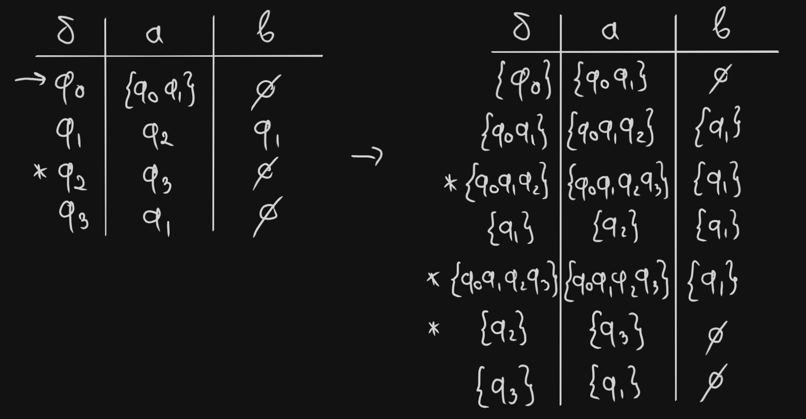
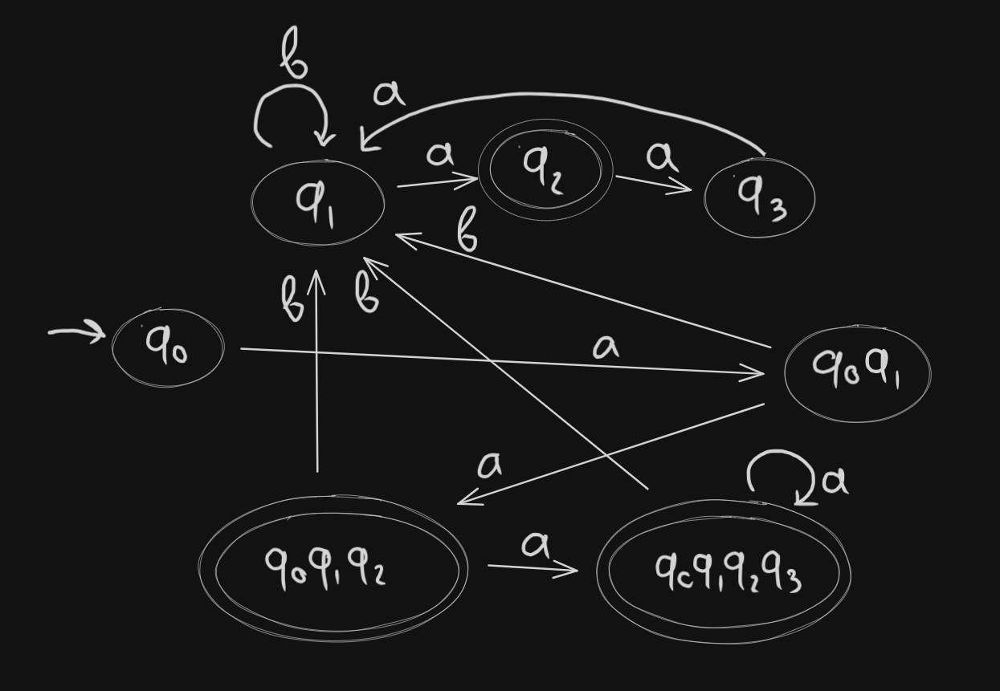

# Lab 2 Report: Determinism in Finite Automata. Conversion from NDFA 2 DFA. Chomsky Hierarchy

### Course: Formal Languages & Finite Automata
### Author: Ivan Rudenco

----

## Theory:
Regular grammars are formal systems used to describe regular languages, which can be recognized by finite automata.
They consist of production rules that generate strings following a specific pattern, typically defined by regular expressions.
They are like step-by-step instructions for building words that follow specific patterns. These patterns can be checked using finite automata, which are like tiny decision-making machines with a limited number of states.
Finite automata are abstract machines with a finite number of states used to process strings and determine whether they belong to a given regular language.
There are two types of finite automata: deterministic, where each input leads to a unique state, and nondeterministic, where multiple transitions can exist for the same input.
Regular grammars and finite automata are equivalent in expressive power, meaning any language described by a regular grammar can be accepted by a finite automaton and vice versa.

## Objectives:

1. Understand what an automaton is and what it can be used for.

2. Continuing the work in the same repository and the same project, the following need to be added:
    a. Provide a function in your grammar type/class that could classify the grammar based on Chomsky hierarchy.

    b. For this you can use the variant from the previous lab.

3. According to your variant number (by universal convention it is register ID), get the finite automaton definition and do the following tasks:

    a. Implement conversion of a finite automaton to a regular grammar.

    b. Determine whether your FA is deterministic or non-deterministic.

    c. Implement some functionality that would convert an NDFA to a DFA.
    
    d. Represent the finite automaton graphically (Optional, and can be considered as a __*bonus point*__):
      
    - You can use external libraries, tools or APIs to generate the figures/diagrams.
        
    - Your program needs to gather and send the data about the automaton and the lib/tool/API return the visual representation.


## Implementation description
### Classify grammar based on Chomsky hierarchy

To classify the grammar rules of my variant based on Chomsky hierarchy, I added a new `classify` method to the `Grammar` class. It goes through the gammar rules, analyzing non-termainal symbols `lhs`, and corresponding productions `rhs_list`.


```py
for lhs, rhs_list in self.p.items():
    for rhs in rhs_list:
        lhs_len = len(lhs)
        rhs_len = len(rhs)      
```

If any `lhs` is not in non-terminals, the grammar is Type 0 (unrestricted).
If any `lhs` has length greater than 1, it's not Type 2 (context-free).
If any production shortens `(lhs_len > rhs_len)`, it's not Type 1 (context-sensitive).
If any `rhs` doesn't match a regular pattern, it's not Type 3 (regular).

```py
if lhs not in self.vn:
    return "type 0 unrestricted"

if lhs_len != 1:
    type2 = False

if lhs_len > rhs_len:
    type1 = False

if not ((rhs[0] in self.vt and (len(rhs) == 1 or (len(rhs) == 2 and rhs[1] in self.vn)))):
    type3 = False
```

----

### Convert FA to regular grammar
```
Variant 25
Q = {q0,q1,q2,q3},
∑ = {a,b},
F = {q2},
δ(q0,a) = q0,
δ(q0,a) = q1,
δ(q1,a) = q2,
δ(q1,b) = q1,
δ(q2,a) = q3,
δ(q3,a) = q1.
```
In order to better visualize the given FA, I made a transition table and a sketch of the FA:


With the table obtained, it's easy to write grammar production rules, with states as non-terminal symbols, and transitions based on possible inputs.


### Determine whether it's a DFA or NFA

This is a NFA, since it has states which have multiple transitions for the same input symbol `(q0 --> aq0 | aq1)`.

### Convert NFA to DFA

Using the transition table from the 1st task, I made a new table, with a new DFA state for each possible input combination from the initial NFA. State `{q0}` still remains as the initial state. States `{q0 q1 q2}`, `{q0 q1 q2 q3}`, `{q2}` are the new final states for the DFA, since they contain `{q2}` - final state from initial NFA. The obtained table doesn't have any ambiguous transitions, and therefore a DFA can be constructed from it.



With the transition table obtained, I made graphical representation of the new DFA:



## Conclusions

In conclusion, the task was implemented, but I had to make the NFA to DFA conversion on paper instead of code. I decided that doing it by hand would be a better learning experience and will help me understand the topic more than using 3rd party libraries or code. The results demonstrated that the given FA was non-deterministic because of multiple transitions for the same input, and successfully converting it to a DFA ensured a deterministic behavior. The transition tables and graphical representations further reinforced the practical applications of these concepts. Overall, this lab improved my understanding of formal languages and automata, and I gained experience on how to work with FA.

## References
- [thank God Indians exist](https://www.youtube.com/watch?v=jN8zvENdjBg)
- [good ol' friend](https://chatgpt.com/)